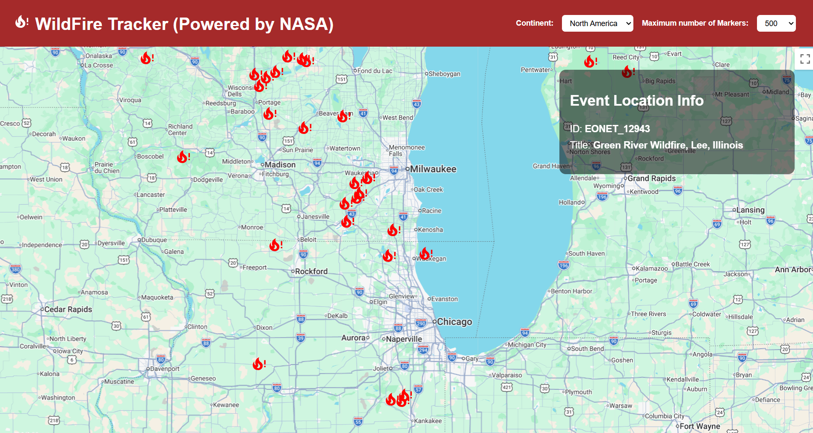
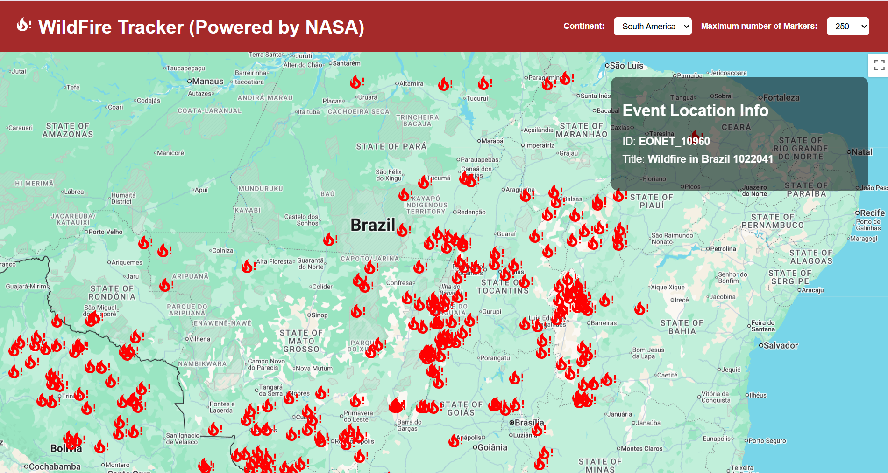

# Wildfire Tracker

Interactive web application that visualizes real-time wildfire data on a dynamic map using NASA’s EONET API and Google Maps.

---

## Demo

### North America View


### South America View


---

## Features

- 🌍 Interactive map powered by Google Maps API  
- 🔥 Real-time wildfire data from NASA EONET API  
- 🧭 Filter wildfires by continent  
- 📍 Display only wildfires within the current map viewport for improved performance 
- ⚡ Optimized performance by limiting number of rendered markers  
- 🖱️ Clickable markers showing wildfire details

---

## Tech Stack

- **Frontend:** React  
- **Maps:** Google Maps API (`google-map-react`)  
- **Data:** NASA EONET API  
- **Styling:** CSS  

---

## How It Works

1. Fetch wildfire data from NASA EONET API  
2. Filter events to only include wildfires  
3. Apply continent-based filtering using bounding boxes  
4. Filter further based on current map viewport  
5. Limit number of markers to maintain performance  
6. Render markers dynamically on the map  
7. Display additional info when a marker is clicked  

---

## Setup

### 1. Clone the repository
```bash
git clone https://github.com/wilsonftrindade/wildfire-map-tracker.git
cd wildfire-tracker
```

### 2. Install dependencies
```bash
npm install
```

### 3. Add your Google Maps API key
Create a .env file in the root directory:
```bash
REACT_APP_GOOGLE_MAPS_API_KEY=your_api_key_here
```

### 4. Run the app
```bash
npm start
```

---

## 📌 Future Improvements

- Marker clustering for dense regions  
- Backend integration for caching and preprocessing data  